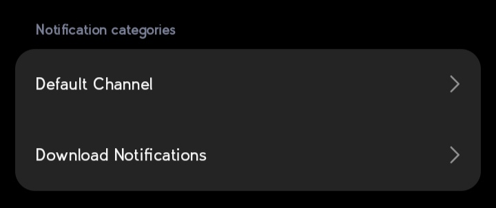

# Advanced Features

> Need a notification inside a foreground service? See the [Foreground Services](foreground-services.md) page.

## Updating notifications

Notifications can be updated in real-time. Pass the notification `id` (or reuse the same instance) to update instead of creating a new one.

:::{pydroid}
notification = Notification(title="Old title", message="Old message").send()
:::

Update title and/or message:

```python
notification.updateTitle("New title")
notification.updateMessage("New message")
```

## Adding style even when already sent

Use `.refresh()` to apply any new changes after sending:

:::{pydroid}
notification = Notification(title="Downloading", message="0%")
notification.send()

notification.setLargeIcon("imgs/profile.png")
notification.refresh()
:::

## Channel management

Android 8.0+ requires notifications to belong to a channel. The default channel is created for you, but you can create, check and delete your own.

:::{pydroid}
from android_notify import Notification

# Create a channel
Notification.createChannel(
    id="news",
    name="News",
    description="Breaking news updates",
    importance="high",       # 'urgent', 'high', 'medium', 'low', 'none'
    vibrate=False,
)

# Send through the channel
Notification(
    title="New article",
    message="Check out the latest article",
    channel_id="news",
).send()
:::

Read the channels that exist on the device before sending:

```python
from android_notify import Notification

# Check if a single channel exists
exists = Notification.channelExists("news")          # True / False

# Check a list of channels -> returns only the IDs that are missing
missing = Notification.doChannelsExist(["news", "promo"])
print("Missing channels:", missing)

# List every channel created by the app
channels = Notification.getChannels()
# [
#   {'id': 'news', 'name': 'News', 'description': '', 'state': True,
#    'importance': '3', 'sound': 'None', 'vibration': 'None', 'j_obj': <...>},
#   ...
# ]
```
`state` is `True` if the channel is turned on by the user (importance > `NONE`). `importance`, `sound` and `vibration` come back as strings, except `vibration` and `sound` which are `None` when not set.

Channels can be deleted at runtime. Once deleted, notifications using that channel are no longer shown and the user has to re-create it:

```python
from android_notify import Notification

# Delete one channel, returns True if deleted, False if not found
deleted = Notification.deleteChannel("news")

# Delete every channel, returns the count removed
count = Notification.deleteAllChannel()
print(f"Deleted {count} channels")
```



## Silent notifications

:::{pydroid}
from android_notify import Notification

Notification(
    title="Silent update",
    message="No sound or heads-up",
    silent=True,
).send()
:::

## Persistent notifications

Keep the notification in the tray until cancelled by the user or the app:

:::{pydroid}
notification = Notification(
    title="Downloading...",
    message="Large file",
    persistent=True,
).send()
:::

## Controlling popups (heads-up)

:::{pydroid}
from android_notify import Notification
import time

notification = Notification(
    title="Processing...",
    message="Starting task",
).send()
time.sleep(10)

# show heads-up when updated
notification.setOnlyAlertOnce(False)

notification.updateTitle("Processing Complete!")
notification.updateMessage("Task finished successfully")
:::

## Custom sound

**Option 1: Audio files bundled in `res/raw`**

- Put audio files in the `res/raw` folder.
- From `buildozer.spec` point to the res folder: `android.add_resources = res`.
- Include the format: `source.include_exts = wav`.

```python
from android_notify import Notification

# Create a custom notification channel with a unique sound resource for android 8+
Notification.createChannel(
    id="weird_sound_tester",
    name="Weird Sound Tester",
    description="A test channel for custom sounds from the res/raw folder.",
    res_sound_name="sneeze"  # file name without .wav or .mp3
)

# Send a notification through the created channel
n = Notification(
    title="Custom Sound Notification",
    message="This tests playback of a custom sound (sneeze.wav) stored in res/raw.",
    channel_id="weird_sound_tester"  # important: tells the notification to use the right channel
)
n.setSound("sneeze")  # for android 7 and below
n.send()
```

**Option 2: Local file path or URI (`sound_path`)**

You can use a local audio file, a `content://`, `file://`, or `android.resource://` URI directly:

```python
from android_notify import Notification

# Using a local file path
Notification.createChannel(
    id="local_sound",
    name="Local Sound",
    sound_path="/storage/emulated/0/Download/alert.mp3"
)

# Using a content URI (e.g. from media store)
Notification.createChannel(
    id="uri_sound",
    name="URI Sound",
    sound_path="content://media/external/audio/media/123"
)

# Send notification with custom sound path
n = Notification(
    title="Custom Sound",
    message="Playing from local path",
    channel_id="local_sound"
)
n.setSound(sound_path="/storage/emulated/0/Download/alert.mp3")
n.send()
```

Private files (e.g. in the app's `data/` directory) are automatically copied to external storage before playing.

## Vibration

For the vibrate feature to work correctly, make sure to use version `1.61.0` or later. You also need the `VIBRATE` permission in your `buildozer.spec`:

```ini
android.permissions = VIBRATE
```

For Android 8+, enable vibration on the channel:

:::{pydroid}
from android_notify import Notification

# Create a channel with vibration enabled
Notification.createChannel(
    id='shake',
    name="Shake Passage",
    vibrate=True
)

n = Notification(
    title='Vibrate',
    channel_id='shake'
)
n.send()
:::

Otherwise you can make the notification itself vibrate:

:::{pydroid}
notification = Notification(
    title="Vibration",
    message="Buzz buzz",
    vibrate=True,
).send()
:::

Custom vibration pattern (Android < 8):

```python
notification.setVibrate([0, 500, 200, 500])
```

Some Android devices have a setting to only vibrate on silent. If vibration is a must, call `fVibrate()` to invoke the device vibrator (useful for alarms):

```python
n.fVibrate()
```

## Click handlers and data

`NotificationHandler.data_object` returns a `dict` of data in the clicked notification. `setData` can be called after `send` to change the stored `data_object`. Use the `name` argument if the value is constant.

:::{pydroid}
from android_notify import Notification

notification = Notification(title="Hello", name="change page")
notification.setData({"next wallpaper path": "test.jpg"})
notification.send()
:::

```python
from android_notify import NotificationHandler

# get the data of the notification used to open the app
notification_data = NotificationHandler.data_object
# {"next wallpaper path": "test.jpg", "name": "change page"}
```

Get the name of the notification used to open the app:

```python
from android_notify import NotificationHandler

name = NotificationHandler.get_name(on_start=True)
```

A common pattern is to route the app to the right place based on which notification opened it:

```python
from kivymd.app import MDApp
from android_notify import Notification, NotificationHandler


def use_name(name):
    if name == 'change_app_page':
        # Code to change Screen
        pass
    elif name == 'change_app_color':
        # Code to change Screen Color
        pass


class MyApp(MDApp):
    def on_start(self):
        name = NotificationHandler.get_name(on_start=True)
        use_name(name)

    def build(self):
        Notification(
            title="Change Page",
            message="Click to change App page.",
            name='change_app_page'
        ).send()

        Notification(
            title="Change Color",
            message="Click to change App Color",
            name='change_app_color'
        ).send()

    def on_resume(self):
        # Is called every time the app is reopened
        name = NotificationHandler.get_name()
        use_name(name)
```

## Cancel notifications

:::{pydroid}
notification = Notification(title="Hello", message="World").send()

# Later, cancel it
notification.cancel()
:::

Cancel all notifications:

:::{pydroid}
Notification.cancelAll()
:::

## Priority

On devices below Android 8 there are no channels, so importance is set per notification with `setPriority()`. For Android 8+ use the channel's `importance` instead.

:::{pydroid}
from android_notify import Notification

notification = Notification(title="Urgent", message="Important").send()
notification.setPriority("high")  # 'urgent', 'high', 'medium', 'low', 'none'
:::

## Misc

- `setWhen(secs_ago)` — set the timestamp shown on the notification (seconds ago).
- `setObeyUserClear(state)` — whether re-triggering the notification after the user cleared it from the tray is allowed.
- `isInTray()` — check if the notification is still shown in the tray.
- `fill_args()` / `start_building()` — fill/build the notification without posting it, used with foreground services (see the [Foreground Services](foreground-services.md) page).
- `NotificationHandler.bindNotifyListener()` / `unbindNotifyListener()` — listen for notification open events in your app.