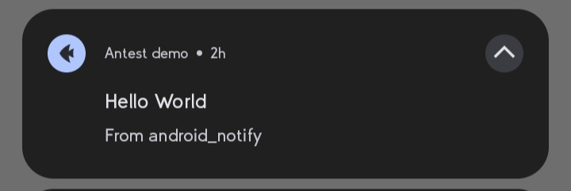

# Quick Start

## Basic notification

```python
from android_notify import Notification

Notification(
    title="Hello",
    message="This is a basic notification."
).send()
```


```python
from android_notify import Notification

# Basic notification on a Flet app
Notification(
    title="Hello from Flet",
    message="This is a basic notification."
).send()
```



## How it works

- `Notification` builds and dispatches a notification on the device (Android 4.1 and above).
- `NotificationHandler` handles permission requests, app activation on notification click, and reading the data attached to a clicked notification.
- `send_notification(...)` is the functional equivalent of `Notification(...).send()`.
- `NotificationStyles` is a deprecated (v1.59) convenience class. Prefer the dedicated methods (`setBigPicture`, `setLargeIcon`, `setBigText`, `setLines`, ...) on the `Notification` instance.

## Permissions

On Android 13+, the library automatically asks for the `POST_NOTIFICATIONS` permission when you create a notification. You can also request it manually:

```python
from android_notify import NotificationHandler

NotificationHandler.asks_permission()
```

Check whether permission is already granted:

```python
from android_notify import NotificationHandler

has_permission = NotificationHandler.has_permission()
```