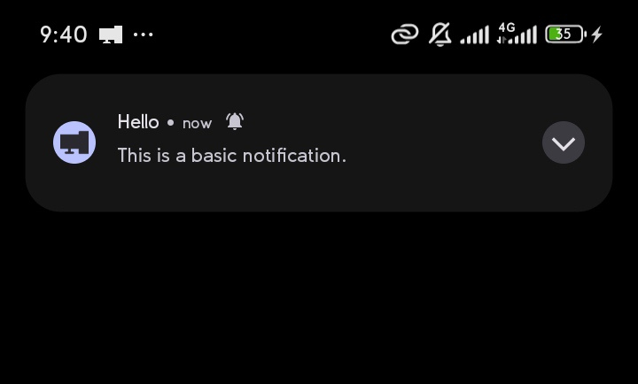

# Quick Start

> Most runnable examples have an **In-App** / **Pydroid 3** toggle. The **Pydroid 3** tab wraps the same snippet in a Kivy app with a *Run Code* button, so you can copy it into [Pydroid 3](https://play.google.com/store/apps/details?id=ru.iiec.pydroid3) and run it straight on your phone.

## Basic notification

:::{pydroid}
from android_notify import Notification

Notification(
    title="Hello",
    message="This is a basic notification."
).send()
:::

## How it works

- `Notification` builds and dispatches a notification on the device (Android 4.1 and above).
- `NotificationHandler` handles permission requests, app activation on notification click, and reading the data attached to a clicked notification.
- `send_notification(...)` is the functional equivalent of `Notification(...).send()`.
- `NotificationStyles` is a deprecated (v1.59) convenience class. Prefer the dedicated methods (`setBigPicture`, `setLargeIcon`, `setBigText`, `setLines`, ...) on the `Notification` instance.

## Permissions

On Android 13+, the library automatically asks for the `POST_NOTIFICATIONS` permission when you create a notification. You can also request it manually:

:::{pydroid}
from android_notify import NotificationHandler

NotificationHandler.asks_permission()
:::

Check whether permission is already granted:

:::{pydroid}
from android_notify import NotificationHandler

has_permission = NotificationHandler.has_permission()
:::