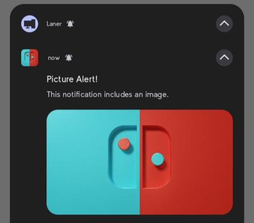
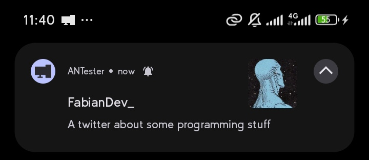
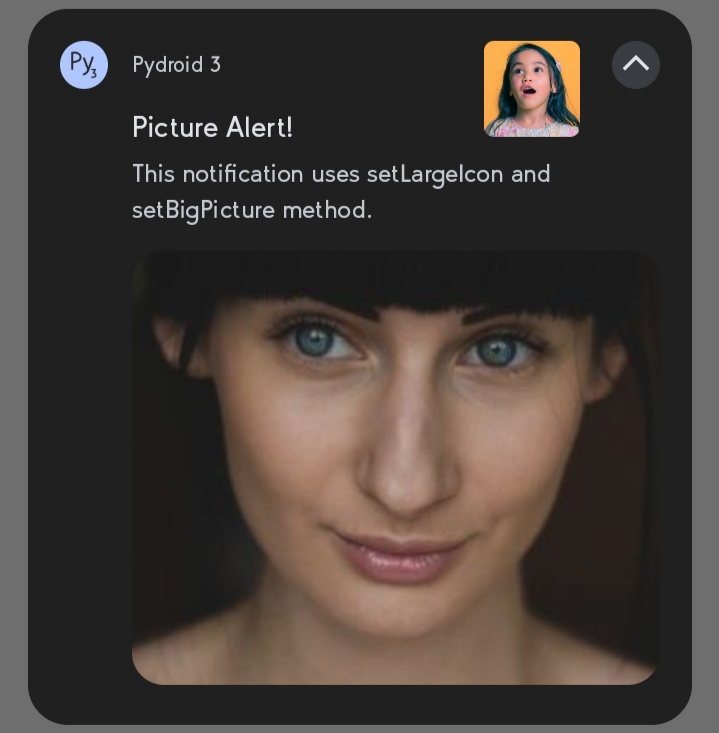
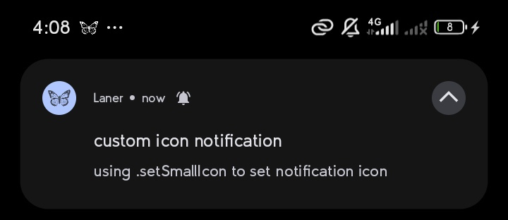
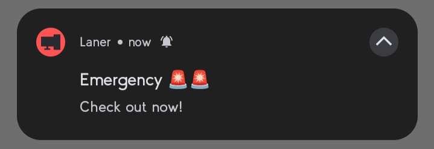
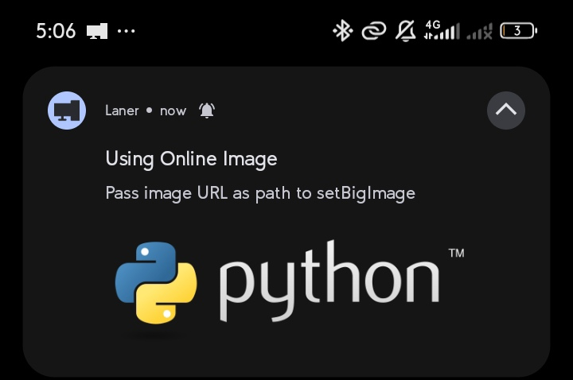
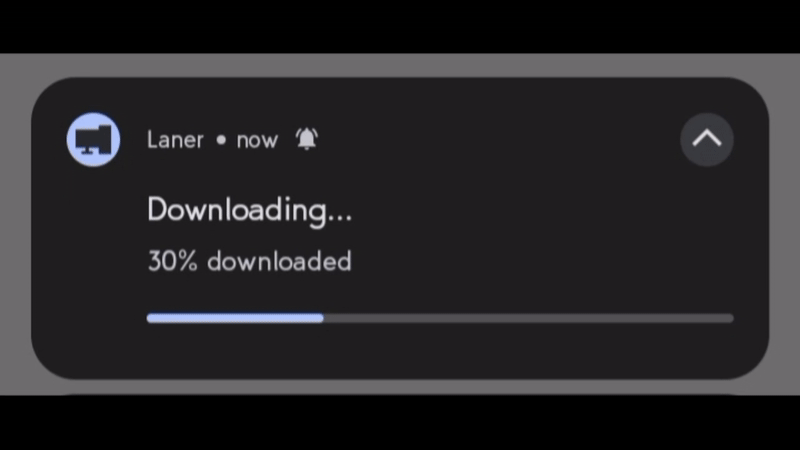
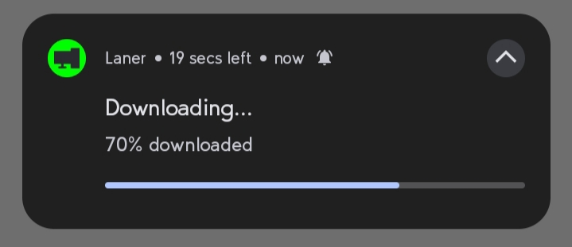
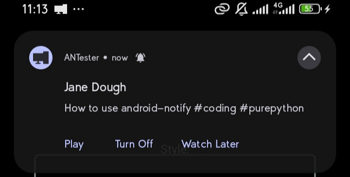

# Usage & Styles

## Images

Source can be local file paths or complete URLs, except `setSmallIcon` which only accepts local `png` files.

| Method | Description |
| --- | --- |
| `setBigPicture` | Shows an image below the notification when the user expands it. |
| `setLargeIcon` | Appears at the right side of the notification content. |
| `setSmallIcon` | Changes the app icon to a custom `png`. |
| `setColor` | Changes the app icon background color. |

### Big Picture

Shows a large image when the notification is expanded:

:::{pydroid}
from android_notify import Notification

notification = Notification(
    title='Picture Alert!',
    message='This notification uses the setBigPicture method.'
)
notification.setBigPicture("https://i.pravatar.cc/300")
notification.send()
:::



### Large Icon

Appears at the right side of the notification content:

:::{pydroid}
from android_notify import Notification

notification = Notification(
    title="FabianDev_",
    message="A twitter about some programming stuff."
)
notification.setLargeIcon("https://i.pravatar.cc/300")
notification.send()
:::



### Both images

Use `setBigPicture` and `setLargeIcon` together on the same notification:

:::{pydroid}
from android_notify import Notification

notification = Notification(
    title='Picture Alert!',
    message='This notification uses setLargeIcon and setBigPicture together.'
)
notification.setBigPicture("https://i.pravatar.cc/300")
notification.setLargeIcon("https://i.pravatar.cc/300")
notification.send()
:::



### Custom Small Icon

Changes the app icon. Must be a local `png` file (otherwise it renders as a black box):

:::{pydroid}
from android_notify import Notification

notification = Notification(
    title='Custom Icon',
    message='This notification uses setSmallIcon.'
)
notification.setSmallIcon("icons/butterfly.png")
notification.send()
:::



### Custom Color

Changes the app icon background color. Strings like `red`, `green`, `blue` work without a hex code:

:::{pydroid}
from android_notify import Notification

notification = Notification(
    title='Custom Icon and Color',
    message='This notification uses setColor and setSmallIcon.'
)
notification.setColor("red")  # or "#FF0000"
notification.setSmallIcon("icons/butterfly.png")
notification.send()
:::



### Online Images

Local paths or URLs both work. For online images the URL should start with `https://` and you need the internet permission (`android.permissions = INTERNET`) in your `buildozer.spec` or `pyproject.toml`:

:::{pydroid}
from android_notify import Notification

notification = Notification(
    title="Using Online Image",
    message="Pass image URL as path to setBigPicture."
)
notification.setBigPicture("https://www.python.org/static/img/python-logo.png")
notification.send()
:::



## Progress bar

- `updateProgressBar(current_value, message, title)` — update progress in real-time.
- `showInfiniteProgressBar` — shows an infinite progress animation.
- `removeProgressBar(message, show_on_update=True, title)` — cleanly remove the progress bar. It optionally shows the final update briefly before hiding (`show_on_update=True`).

:::{pydroid}
from android_notify import Notification
from kivy.clock import Clock

progress = 0

notification = Notification(
    title="Downloading...", message="0% downloaded",
    progress_current_value=0, progress_max_value=100
)
notification.send()

def update_progress(dt):
    global progress
    progress = min(progress + 10, 100)

    if progress == 100:
        notification.removeProgressBar(title="File Downloaded", message="super_large_file.zip")
    elif progress >= 80:
        notification.showInfiniteProgressBar()
    else:
        notification.updateProgressBar(progress, f"{progress}% downloaded")

    return progress < 100  # Ends loop when reaching 100%

Clock.schedule_interval(update_progress, 3)
:::



**Update frequency** — Android ignores updates faster than **0.5 seconds**. android-notify automatically handles rapid updates by cancelling old ones if a new update arrives within 1 second.

## Texts

| Method | Description |
| --- | --- |
| `addLine` | Adds a line to the notification, useful for inbox style. |
| `setSubText` | Sets a smaller text that appears at the side of the app name. |
| `setBigText` | Sets a longer text that appears when the notification is expanded. |
| `updateTitle` | Updates the title text of the notification. |
| `updateMessage` | Updates the main message text of the notification. |

### Sub Text

A smaller text that appears beside the app name, often used to provide context like download seconds remaining:

:::{pydroid}
from android_notify import Notification

notification = Notification(
    title="Downloading...",
    message="70% downloaded",
    progress_max_value=100,
)
notification.setSubText("19 secs left")
notification.send()
:::



### Multi-Line (Inbox Style)

Use `addLine` to add each line. Lines are revealed when the user expands the notification:

:::{pydroid}
from android_notify import Notification

notification = Notification(
    title="5 New mails from Frank",
    message="Check them out",
)
notification.setSubText("FabianCodes")
notification.setLargeIcon("https://i.pravatar.cc/300")
notification.addLine("Re: Planning")
notification.addLine("Delivery on its way")
notification.addLine("Follow-up")
notification.send()
:::


### Big Text

A longer text that is revealed when the notification is expanded. The `message` acts as the sub-title:

:::{pydroid}
from android_notify import Notification

notification = Notification(
    title="Article",
    message="History of Lorem Ipsum",
)
notification.setBigText("Lorem Ipsum is simply dummy text of the printing and ...")
notification.send()
:::


## Buttons

You can add action buttons with custom callbacks. When a button is pressed the callback runs, and the app can open with the click.

:::{pydroid}
from android_notify import Notification

notification = Notification(
    title="Save Password?",
    message="The password was found in the leak database."
)

def save_password(*args):
    print("Saving password...")

def not_now(*args):
    print("Skipping...")

notification.addButton("Save", on_release=save_password)
notification.addButton("Not now", on_release=not_now)
notification.send()
:::



### Broadcast buttons

By default a button callback runs when the app opens (or reopens). If you want a button to trigger a function **without opening the app**, pass a custom BroadcastReceiver name and an optional intent action:

:::{pydroid}
from android_notify import Notification

notification = Notification(
    title="Save Password?",
    message="The password was found in the leak database."
)

def save_password(*args):
    print("Saving password...")

notification.addButton(
    "Save",
    on_release=save_password,
    receiver_name="PasswordReceiver",
    action="com.myapp.SAVE_PASSWORD"
)
notification.send()
:::

For steps to create broadcast buttons, visit the [android-notify wiki](https://github.com/Fector101/android_notify/wiki/How-to-Use-with-Broadcast-Listener) - make things happen without opening the app.

## Colored texts

You can customize the title and message colors. Using hex codes is safest.

```python
from android_notify import Notification

notification = Notification(
    title="Custom Colors",
    message="This notification uses custom title and message colors.",
    title_color="#FF5722",   # example hex
    message_color="#2196F3"
)
notification.send()
```

### Colored texts setup (dev)

To control the title and message colors you also need a custom notification layout in your app:

1. Create a folder named `res/layout` in your app.
2. Copy these files using the exact names:

`an_colored_basic_small.xml`:

```xml
<?xml version="1.0" encoding="utf-8"?>
<LinearLayout xmlns:android="http://schemas.android.com/apk/res/android"
    android:layout_width="match_parent"
    android:layout_height="wrap_content"
    android:orientation="vertical">

    <TextView
        android:id="@+id/title"
        android:layout_width="wrap_content"
        android:layout_height="0dp"
        android:layout_weight="1"
    />

</LinearLayout>
```

`an_colored_basic_large.xml`:

```xml
<?xml version="1.0" encoding="utf-8"?>
<LinearLayout xmlns:android="http://schemas.android.com/apk/res/android"
    android:layout_width="match_parent"
    android:layout_height="wrap_content"
    android:orientation="vertical">

    <TextView
        android:id="@+id/title"
        android:layout_width="wrap_content"
        android:layout_height="0dp"
        android:layout_weight="1"
    />

    <TextView
        android:id="@+id/message"
        android:layout_width="match_parent"
        android:layout_height="wrap_content"
        android:layout_marginTop="4dp"
    />

</LinearLayout>
```

3. In your `buildozer.spec` include these settings:

```ini
source.include_exts = py,kv,xml
android.add_resources = res
```

Then use the `title_color` and/or `message_color` params with hex color codes to control the colors.

## Notification styles overview

The library supports these styles (the deprecated `NotificationStyles` class exposed them; use the instance methods instead):

- `simple`
- `progress`
- `inbox`
- `big_text`
- `large_icon`
- `big_picture`
- `both_imgs`