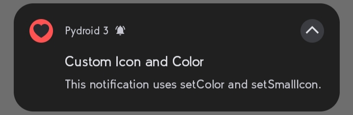
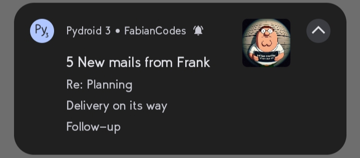

# Usage & Styles

## Images

Source can be local file paths or complete URLs, except `setSmallIcon` which only accepts local `png` files.

| Method | Description |
| --- | --- |
| `setBigPicture` | Shows an image below the notification when the user expands it. |
| `setLargeIcon` | Appears at the right side of the notification content. |
| `setSmallIcon` | Changes the app icon to a custom `png`. |
| `setColor` | Changes the app icon background color. |

For online images the URL should start with `https://` and you need the internet permission (`android.permissions = INTERNET`) in your `buildozer.spec` or `pyproject.toml`.

```python
from android_notify import Notification

notification = Notification(
    title='Picture Alert!',
    message='This notification uses setLargeIcon and setBigPicture method.'
)
notification.setBigPicture("imgs/photo.png")
notification.setLargeIcon("imgs/profile.png")
notification.send()
```


```python
from android_notify import Notification

notification = Notification(
    title='Custom Icon and Color',
    message='This notification uses setColor and setSmallIcon.'
)
notification.setColor("red")
notification.setSmallIcon("love.png")
notification.send()
```



## Progress bar

- `updateProgressBar(current_value, message, title)` — update progress in real-time.
- `showInfiniteProgressBar` — shows an infinite progress animation.
- `removeProgressBar(message, show_on_update=True, title)` — cleanly remove the progress bar.

```python
from android_notify import Notification
from kivy.clock import Clock

progress = 0

notification = Notification(
    title="Downloading...", message="0% downloaded",
    progress_current_value=0, progress_max_value=100
)
notification.send()

def update_progress(dt):
    global progress
    progress = min(progress + 10, 100)

    if progress == 100:
        notification.removeProgressBar(title="File Downloaded", message="super_large_file.zip")
    elif progress >= 80:
        notification.showInfiniteProgressBar()
    else:
        notification.updateProgressBar(progress, f"{progress}% downloaded")

    return progress < 100  # Ends loop when reaching 100%

Clock.schedule_interval(update_progress, 3)
```


## Texts

| Method | Description |
| --- | --- |
| `addLine` | Adds a line to the notification, useful for inbox style. |
| `setSubText` | Sets a smaller text that appears at the side of the app name. |
| `setBigText` | Sets a longer text that appears when the notification is expanded. |
| `updateTitle` | Updates the title text of the notification. |
| `updateMessage` | Updates the main message text of the notification. |

```python
from android_notify import Notification

notification = Notification(
    title="5 New mails from Frank",
    message="Check them out",
)
notification.setSubText("FabianCodes")
notification.setLargeIcon("imgs/profile.png")
notification.addLine("Re: Planning")
notification.addLine("Delivery on its way")
notification.addLine("Follow-up")
notification.send()
```



## Buttons

You can add action buttons with custom callbacks. When a button is pressed the callback runs, and the app can open with the click.

```python
from android_notify import Notification

notification = Notification(
    title="Save Password?",
    message="The password was found in the leak database."
)

def save_password(*args):
    print("Saving password...")

def not_now(*args):
    print("Skipping...")

notification.addButton("Save", on_release=save_password)
notification.addButton("Not now", on_release=not_now)
notification.send()
```


## Colored texts

You can customize the title and message colors. Using hex codes is safest.

```python
from android_notify import Notification

notification = Notification(
    title="Custom Colors",
    message="This notification uses custom title and message colors.",
    title_color="#FF5722",   # example hex
    message_color="#2196F3"
)
notification.send()
```

## Notification styles overview

The library supports these styles (the deprecated `NotificationStyles` class exposed them; use the instance methods instead):

- `simple`
- `progress`
- `inbox`
- `big_text`
- `large_icon`
- `big_picture`
- `both_imgs`